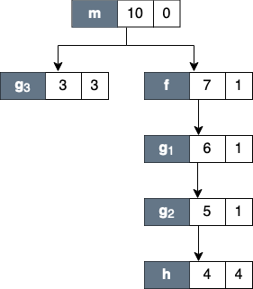
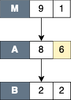

<!--
SPDX-FileCopyrightText: Contributors to the HPCToolkit Project

SPDX-License-Identifier: CC-BY-4.0
-->

<a id="sec:profile"/>

## Profile View

Profile view is the default view, and it interactively presents context-sensitive performance metrics correlated to program structure and mapped to a program's source code, if available. It can show an arbitrary collection of performance metrics gathered during one or more runs.

<a id="fig:hpcviewer-legend" />

| Profile View: An annotated screenshot of hpcviewer's interface |
| :----------------------------------------------: |
||

Figure [Profile View](#fig:hpcviewer-legend) above shows an annotated screenshot of `hpcviewer`'s user interface presenting a call path profile.
The annotations highlight `hpcviewer`'s principal window panes and key controls.
The browser window is divided into three panes.
The **Source pane** (top) displays the program source code.
The **Navigation** and **Metric panes** (bottom) associate a table of performance metrics with static or dynamic program structure.
These panes are discussed in more detail in Section [Panes](#sec:hpcviewer:panes).

`hpcviewer` displays calling-context-sensitive performance data in three views: *Top-down*, *Bottom-up*, and *Flat View*.
One selects the desired view by clicking on the corresponding view control tab.
We briefly describe the three views and their corresponding purposes.

- **Top-down View**.
  This top-down view shows the dynamic calling contexts (call paths) in which costs were incurred.
  Using this view, one can explore performance measurements of an application in a top-down fashion to understand the costs incurred by calls to a procedure in a particular calling context.
  We use the term *cost* rather than simply *time* since `hpcviewer` can present a multiplicity of metrics, such as cycles, cache misses, or derived metrics (e.g., cache miss rates or bandwidth consumed) that are other indicators of execution cost.
  <br/>
  A calling context for a procedure `f` consists of the stack of procedure frames active when the call was made to `f`.
  Using this view, one can readily see how much of the application's cost was incurred by `f` when called from a particular calling context.
  If finer detail is of interest, one can explore how the costs incurred by a call to `f` in a particular context are divided between `f` itself and the procedures it calls.
  HPCToolkit's call path profiler `hpcrun` and the `hpcviewer` user interface distinguish calling context precisely by individual call sites; this means that if a procedure `g` contains calls to procedure `f` in different places, these represent separate calling contexts.

- **Bottom-up View**.
  This bottom-up view enables one to look upward along call paths.
  The view apportions a procedure's costs to its callers and, more generally, its calling contexts.
  This view is particularly useful for understanding the performance of software components or procedures used in multiple contexts.
  For instance, a message-passing program may call `MPI_Wait` in many different calling contexts.
  The cost of any particular call will depend upon the structure of the parallelization in which the call is made.
  Serialization or load imbalance may cause long waits in some calling contexts, while other parts of the program may have short waits because computation is balanced and communication is overlapped with computation.
  <br/>
  When several levels of the Bottom-up View are expanded, saying that it apportions metrics of a callee on behalf of its callers can be confusing. More precisely, the Bottom-up View apportions the metrics of a procedure on behalf of the various *calling contexts* that reach it.

- **Flat View**.
  This view organizes performance measurement data according to the static structure of an application.
  All costs incurred in any calling context by a procedure are aggregated in the Flat View.
  This complements the Top-down View, in which the costs incurred by a particular procedure are represented separately for each call to the procedure from a different calling context.


<a name="sec:hpcviewer:panes" />

## Panes

`hpcviewer`'s browser window is divided into three panes: the *Source pane*, *Navigation pane*, and the *Metrics pane*.
We briefly describe the role of each pane.

### Source Pane

The source pane displays the source code associated with the current entity selected in the navigation pane.
When a performance database is first opened with `hpcviewer`, the source pane is initially blank because no entity has been selected in the navigation pane.
Selecting any entity in the navigation pane will cause the source pane to load the corresponding file and highlight the line corresponding to the selection.
Switching the source pane to display a different source file is accomplished by making another selection in the navigation pane.

### Navigation Pane

The navigation pane presents a hierarchical tree-based structure used to organize the presentation of an applications's performance data.
Entities in the navigation pane's tree include load modules, files, procedures, procedure activations, inlined code, loops, and source lines.
Selecting any of these entities will cause its corresponding source code (if any) to be displayed in the source pane.
In this view, one can reveal or conceal children in this hierarchy by 'opening' or 'closing' any non-leaf (i.e., individual source line) entry.

The node in the tree will have the color blue if the source code is available. Otherwise, its color is black.
If a node is a call statement, it will have the line number of the call statement (if the information is available) and the callee procedure as follows:

> \[`line_number`\] <span class="large-text">»</span> `callee`

Where the symbol <span class="large-text">»</span> represents a call to a procedure.

The nature of the entities in the navigation pane's tree structure depends upon whether one is exploring the Top-down View, the Bottom-up View, or the Flat View of the performance data.

- In the **Top-down View**, entities in the navigation tree represent procedure activations, inlined code, loops, and source lines.
  While most entities link to a single location in source code, procedure activations link to two: the call site from which a procedure was called and the procedure itself.

- In the **Bottom-up View**, entities in the navigation tree are procedure activations.
  Unlike procedure activations in the top-down view, in which call sites are paired with the called procedure, in the bottom-up view, call sites are paired with the calling procedure to allow to attribute the costs of a called procedure to multiple different call sites and callers. The node in this view has the following notation:

> \[`line_number`\] <span class="large-text">«</span> `caller`
  
>   Where the symbol <span class="large-text">«</span> represents a call by a procedure.
   
- In the **Flat View**, entities in the navigation tree correspond to source files, procedure call sites (rendered the same way as procedure activations), loops, and source lines.

<a name="sec:control-panel" />

#### Control Panel

The header above the navigation pane contains some controls for the navigation and metric view.
In Figure [Profile View](#fig:hpcviewer-legend), they are labeled as "navigation control."

- **Flatten**  /
  **Unflatten** 
  (Flat View only):
  Enabling to flatten and unflatten the navigation hierarchy.
  Clicking on the flatten button (the icon that shows a tree node with a slash through it) will replace each top-level scope shown with its children.
  If a scope has no children (i.e., it is a leaf ), the node will remain in the view.
  This flattening operation is useful for relaxing the strict hierarchical view so that peers at the same level in the tree can be viewed and ranked together.
  For instance, this can be used to hide procedures in the Flat View so that outer loops can be ranked and compared to one another.
  The inverse of the flatten operation is the unflatten operation, which causes an elided node in the tree to be made visible once again.

- **Zoom-in**  /
  **Zoom-out**  :
  Depressing the up arrow button will zoom in to show only information for the selected line and its descendants.
  One can zoom out (reversing a prior zoom operation) by depressing the down arrow button.

- **Hot call path**  :
  This button automatically reveals and traverses the hot call path rooted at the selected node in the navigation pane with respect to the selected metric column. Let `n` be the node initially selected in the navigation pane.
  A hot path from `n` is traversed by comparing the values of the selected metric for `n` and its children. If one child accounts for `T%` or more (where `T` is the threshold value for a hot call path) of the cost at `n`, then that child becomes `n` and the process repeats recursively.

- **Add derived metric**  :
  Create a new metric by specifying a mathematical formula.
  See Section [Derived Metrics](#sec:hpcviewer:derived-metrics) for more details.

- **Hide/show metrics**  :
  Show or hide metric columns.
  A metric property view will appear, and the user can select which metric columns should be displayed.

- **Resizing metric columns** /
   :
  Resize the metric columns based on either the width of the data or the width of both of the data and the column's label.

- **Export into a CSV format file**  :
  Export the current metric table into a comma separated value (CSV) format file.
  This feature only exports all metrics that are currently shown.
  Metrics not shown in the view (whose scopes are not expanded) will not be exported (we assume these metrics are not significant).

- **Increase font size**  /
  **Decrease font size**  :
  Increase or decrease the size of the navigation and metric panes.

- **Show a graph of metric values**  (Top-down view only):
  Show a graph (a plot, a sorted plot, or a histogram) of metric values associated with the selected node in CCT for all processes or threads (Section [Plot Graphs](#sec:hpcviewer:plots)).

- **Show the metrics of a set of threads**  (Top-down view only):
  Show the CCT and the metrics of a selected threads (Section [Thread View](#sec:thread-level-table)).

#### Context menus

Navigation control also provides several context menus by clicking the right-button of the mouse.

- **Copy**: Copy into the clipboard the selected line in the navigation pane, which includes the name of the node in the tree and the values of visible metrics in the [metric pane](#sec:pane-metric). The values of hidden metrics will not be copied.
- **Find**: Search for text within the Scope column of the current table. The search has several options, such as case sensitivity, whole word search, and using regular expressions.

<a name="sec:pane-metric" />

### Metric Pane

The metric pane displays one or more performance metrics associated with entities to the left in the navigation pane.
Entities in the tree view of the navigation pane are sorted at each level of the hierarchy by the metric in the selected column.
When `hpcviewer` is launched, the leftmost metric column is the default selection, and the navigation pane is sorted according to the values of that metric in descending order.
One can change the selected metric by clicking on a column header.
Clicking on the header of the selected column toggles the sort order between descending and ascending.

During analysis, one often wants to consider the relationship between two metrics.
This is easier when the metrics of interest are in adjacent columns of the metric pane.
One can change the order of columns in the metric pane by selecting the column header for a metric and then dragging it left or right to its desired position.
The metric pane also includes scroll bars for horizontal scrolling (to reveal other metrics) and vertical scrolling (to reveal other scopes).
Vertical scrolling of the metric and navigation panes is synchronized.

## Understanding Metrics

`hpcviewer` can present an arbitrary collection of performance metrics gathered during one or more runs, or compute derived metrics expressed as formulae. A derived metric may be specified with a formula that typically uses one or more existing metrics as terms in an expression.

For any given scope in `hpcviewer`'s three views, `hpcviewer` computes both *inclusive* and *exclusive* metric values.
First, consider the Top-down View.
Inclusive metrics reflect costs for the entire subtree rooted at that scope.
Exclusive metrics are of two flavors, depending on the scope.
For a procedure, exclusive metrics reflect all costs within that procedure but exclude callees.
In other words, for a procedure, costs are exclusive with respect to dynamic call chains.
For all other scopes, exclusive metrics reflect costs for the scope itself; i.e., costs are exclusive with respect to a static structure.
The Bottom-up and Flat Views contain inclusive and exclusive metric values relative to the Top-down View.
This means, e.g., that inclusive metrics for a particular scope in the Bottom-up or Flat View are with respect to that scope's subtree in the Top-down View.

### How Metrics are Computed

Call path profile measurements collected by `hpcrun` correspond directly to the Top-down View.
`hpcviewer` derives all other views from exclusive metric costs in the Top-down View.
For the Bottom-up View, `hpcviewer` collects the cost of all samples in each function and attribute that to a top-level entry in the Bottom-up View.
Under each top-level function, `hpcviewer` can look up the call chain at all of the contexts in which the function is called.
For each function, `hpcviewer` apportions its costs among each of the calling contexts in which they were incurred.
`hpcviewer` computes the Flat View by traversing the calling context tree and attributing all costs for a scope to the scope within its static source code structure.
The Flat View presents a hierarchy of nested scopes for load modules, files, procedures, loops, inlined code, and statements.


### Example

Assume one has a simple recursive program divided into two source files  `file1.c` and `file2.c` as follows:

```c
// file1.c
f () {
  g ();
}
// m is the main routine
m () {
  f ();
  g ();
}
```

```c
// file2.c
// g can be a recursive function
g () {
  if ( . . ) g ();
  if ( . . ) h ();
}

h () {
}
```


Figure [Top-down View](#fig:cct) below shows the top-down representation of the above program where procedure `m` is the main entry program, which then calls two procedures: `f` and `g`.
Routine `g` can behave as a recursive function depending on the value of the condition branch (lines 3--4).
In this figure, we use numerical subscripts to distinguish between different instances of the same procedure. 
In contrast, in [Bottom-up View](#fig:metrics-callers) and [Flat View](#fig:metrics-flat), we use alphabetic subscripts.
We use different labels because there is no natural one-to-one correspondence between the instances in the different views.

| Top-down View |
| :-----------: |
||
| Each node of the tree has three boxes: the left-most is the name of the node (or in this case the name of the procedure, the center is the inclusive metric cost, and on the right is the exclusive cost.|

<a name="fig:cct" />

Figure [Top-down View](#fig:cct) above shows an example of the call chain execution of the program annotated with both inclusive and exclusive costs.
Computation of inclusive costs from exclusive costs in the Top-down View involves simply summing up all of the costs in the subtree below.

In this figure, we can see that on the right path of the routine `m`, routine `g` (instantiated in the diagram as `g_1`) performed a recursive call (`g_2`) before calling routine `h`.
Although `g_1`, `g_2` and `g_3` are all instances from the same routine (i.e., `g`), we attribute a different cost for each instance.
This separation of cost can be critical to identify which instance has a performance problem.

| Bottom-up View |
| :------------: |
| |

<a name="fig:metrics-callers" />

Figure [Bottom-up View](#fig:metrics-callers) shows the corresponding scope structure for the Bottom-up View and the costs we compute for this recursive program.
The procedure `g` noted as `g_a` (which is a root node in the diagram), has different cost to `g` as a callsite as noted as `g_b`, `g_c` and `g_d`.
For instance, on the first tree of this figure, the inclusive cost of `g_a` is `9`, which is the sum of the highest cost for each path in the [Top-down View](#fig:cct) that includes `g`: the inclusive cost of `g_3` (which is `3`) and `g_1` (which is `6`).
We do not attribute the cost of `g_2` here since it is a descendant of `g_1` (in other term, the cost of `g_2` is included in `g_1`).

| Flat View |
| :-------: |
||

<a name="fig:metrics-flat" />

Inclusive costs need to be computed similarly in the Flat View.
The inclusive cost of a recursive routine is the sum of the highest cost for each branch in calling context tree.
For instance, in Figure [Flat View](#fig:metrics-flat), The inclusive cost of `g_x`, defined as the total cost of all instances of `g`, is `9`, and this is consistently the same as the cost in the bottom-up tree.
The advantage of attributing different costs for each instance of `g` is that it enables a user to identify which instance of the call to `g` is responsible for performance losses.


<a name="sec:hpcviewer:derived-metrics" />

## Derived Metrics

Frequently, the data become useful only when combined with other information such as the number of instructions executed or the total number of cache accesses.
While users don't mind a bit of mental arithmetic and frequently compare values in different columns to see how they relate to a scope, doing this for many scopes is exhausting.
To address this problem, `hpcviewer` provides a mechanism for defining metrics.
A user-defined metric is called a "derived metric."
A derived metric is defined by specifying a spreadsheet-like mathematical formula that refers to data in other columns in the metric table by using `$n` to refer to the value in the `n`th column.

### Formulae

The formula syntax supported by `hpcviewer` is inspired by spreadsheet-like in-fix mathematical formulae.
Operators have standard algebraic precedence.

### Examples

Suppose the database contains information from five executions, where the same two metrics were recorded for each:

1. Metric 0, 2, 4, 6 and 8: total number of cycles
2. Metric 1, 3, 5, 7 and 9: total number of floating point operations

To compute the average number of cycles per floating point operation across all of the executions, we can define a formula as follows:
```
avg($0, $2, $4. $6. $8) / avg($1, $3, $5, $7, $9)
```

### Creating Derived Metrics

A derived metric can be created by clicking the **Derived metric** tool item in the navigation/control pane.
A derived metric window will then appear as shown in Figure [Derived Metric](#fig:hpcviewer-derived-dialog-box) below.

<a name="fig:hpcviewer-derived-dialog-box" />

| Derived metric dialog box |
| :-----------------------: |
||

The window has two main parts:

**Derived metric definition**:
  - *New name for the derived metric*. Supply a string that will be used as the column header for the derived metric.
  - *Formula definition field*.
    In this field, the user can define a formula with a spreadsheet-like mathematical formula.
    A user can type a formula into this field, or use the buttons in *Metrics* pane below to help insert metric terms or function templates.
  - *Metrics*.
    This is used to find the *ID* of a metric.
    For instance, in this snapshot, the metric `WALLCLOCK` has the ID `2`.
    - `Point-wise` button will insert the metric ID with a "dollar" character (`$`) in the formula field. This dollar prefix refers to the metric value at an individual node in the calling context tree (point-wise) or the value at the root of the calling context tree (aggregate).
    - `Aggregate` button will insert the metric ID with prefix "at" character (`@`) in the formula field. This prefix refers to the aggregate (root) value of the metric.
  - *Functions*.
    This is to guide the user who wants to insert functions in the formula definition field.
    Some functions require only one metric as the argument, but some can have two or more arguments.
    For instance, the function `avg()` which computes the average of some metrics, needs at least two arguments.

**Advanced options**:
  - *Augment metric value display with a percentage relative to column total*.
    When this box is checked, each scope's derived metric value will be augmented with a percentage value, which for scope *s* is computed as the 100 * (*s*'s derived metric value) / (the derived metric value computed by applying the metric formula to the aggregate values of the input metrics for the entire execution).
    Such a computation can lead to nonsensical results for some derived metric formulae.
    For instance, if the derived metric is computed as a ratio of two other metrics, the aforementioned computation that compares the scope's ratio with the ratio for the entire program won't yield a meaningful result.
    To avoid a confusing metric display, think before you use this button to annotate a metric with its percent of the total.
  - *Default format*. This option will display the metric value using scientific notation with three digits of precision, which is the default format.
  - *Display metric value as percent*. This option will display the metric value formatted as a percent with two decimal digits. For instance, if the metric has a value `12.3415678`, with this option, it will be displayed as `12.34%`.
  - *Custom format*. This option will present the metric value with your customized format. The format is equivalent to Java's Formatter class, or similar to C's printf format. For example, the format "`%6.2f`" will display six-digit floating-points with two digits to the right of the decimal point.

Note that the entered formula and the metric name will be stored automatically.
One can then review again the formula (or metric name) by clicking the small triangle of the combo box.


<a name="sec:hpcviewer:thread-level" />

## Metrics in Execution-context level

**Execution context** is an abstract concept of a measurable code execution.
For example, in a pure MPI application, an execution context is an MPI rank,
while an execution context of an OpenMP application is an OpenMP thread,
and an execution context of GPU applications can be a GPU stream.
For hybrid MPI+OpenMP applications, its execution context is its MPI rank and its OpenMP master and worker threads.

There are two types of execution context:
- *Physical* which represents the hardware ID of the execution, such as:
  - `NODE`: the ID of the compute node.
  - `CORE`: the CPU core to which the application thread is bound.
- *Logical* which represents any non-physical entity of the program execution, like:
  - `RANK`: the rank of the process (like the MPI process),
  - `THREAD`: the application CPU thread (such as OpenMP thread),
  - `GPUCONTEXT`: the context used to access a GPU (like a GPU device), and
  - `GPUSTREAM`: a stream or queue used to push work to a GPU.


<a name="sec:hpcviewer:plots" />

### Plot Graphs

| Plot graph |
| :--------: |
||
| Plot graph view of a procedure in GAMESS MPI+OpenMP application showing an imbalance where a group of execution contexts have much higher GPU operations than others.|

<a name="fig:hpcviewer-view-scatterplot" />


HPCToolkit Experiment databases that have been generated by `hpcprof` can be used by `hpcviewer` to plot graphs of metric values for each execution context.
This is particularly useful for quickly assessing load imbalance *in context* across the several threads or processes of an execution.
Figure [Plot graph](#fig:hpcviewer-view-scatterplot) shows `hpcviewer` rendering such a plot.
The horizontal axis shows the application execution context sorted by index (in this case, it's MPI rank and OpenMP thread).
The vertical axis shows metric values for each execution context.
Because `hpcviewer` can generate scatter plots for any node in the Top-down View, these graphs are calling-context sensitive.

To create a graph, first select a scope in the Top-down View; in the Figure [Plot graph](#fig:hpcviewer-view-scatterplot), the procedure `gpu_tdhf_apb_j06_pppp_` is selected.
Then, click the graph button  to show the associated sub-menus.
At the bottom of the sub-menu is a list of non-empty metrics for the selected scope.
Each metric contains a sub-menu that lists the three different types of graphs:

- **Plot graph**:
  This standard graph plots metric values ordered by their execution context.
- **Sorted plot graph**:
  This graph plots metric values in ascending order.
- **Histogram graph**:
  This graph is a histogram of metric values.
  It divides the range of metric values into a small number of sub-ranges.
  The graph plots the frequency of the metric that falls into a particular sub-range.

Remark that the label of execution context for a mixed programming model program like a hybrid MPI and OpenMP (Figure [Plot graph](#fig:hpcviewer-view-scatterplot)) is 
> `PROCESS . THREAD`

Hence, if the application is a hybrid MPI and OpenMP program, and the execution contexts are 0.0, 0.1, ... 31.0, 31.1 it means MPI process 0 has two threads: thread 0 and thread 1 (similarly with MPI process 31).

The viewer also provides additional functionalities by right-clicking on the graph to display the context menus:
- **Adjust Axes Ranges**: to reset the axis X, Y, or both.
- **Zoom In/Out**: to zoom-in or zoom-out the current graph.
- **Save As**: to save the current graph to a file in `*.png` or `.jpeg` format.
- **Properties**: to change the settings of the current graph. This setting is not persistent.
- **Display ...**: this menu is only enabled if one right-click on the dot of the graph. It allows to display the [Thread view](#sec:thread-level-table) of the specific execution context.

**Notes**:
- Currently, it is only possible to generate scatter plots for metrics directly collected by `hpcrun`, which excludes derived metrics created within `hpcviewer`.
- Hovering on the dot of the graph will display 


<a name="sec:thread-level-table" />

### Thread View

`hpcviewer` can also displays the metrics of certain execution contexts (threads and/or processes) named **Thread View**.
To select a set of execution contexts, one needs to use the execution-context selection window by clicking  button from the [control panel](#sec:control-panel) in the Top-down view.

<a name="fig:hpcviewer-dialog-thread-select" />

| Selecting execution contexts |
| :---------------------: |
||
| A snapshot of an execution-contexts selection window. One can refine the list of execution contexts using regular expression by selecting the Regular expression checkbox.|

On the [Execution-context selection](#fig:hpcviewer-dialog-thread-select) window, one needs to select the checkbox of the execution context of interest.
To narrow the list, one can specify the thread name on the filter part of the window.
For instance for a hybrid MPI and OpenMP application, to display just the main thread (thread zero), one can type:

> `THREAD 0`

on the filter, and the view only lists all threads 0, such as `RANK 1 THREAD 0`, `RANK 2 THREAD 0`, and `RANK 3 THREAD 0`.

Once execution contexts have been selected, one can click **OK**, and the [Thread View](#fig:hpcviewer-view-thread-level) will be activated.
The tree of the view is the same as the tree from the Top-down view, with the metrics only from the selected execution contexts.
If there is more than one execution context, the metric value is the sum of the values of the selected execution contexts.

<a name="fig:hpcviewer-view-thread-level" />

| Threads view contains a CCT and metrics of a set of threads|
| :--------------------------------------------------------: |
||
|Example of Thread View which displays a set of execution contexts. The first column is a calling-context tree (CCT) equivalent to the CCT in the Top-down View. The second and third columns represent the metrics from the selected execution contexts (in this case, they are the sum of metrics from threads 0.1, to 7.1)|


## Filtering Tree Nodes

<a name="sec:filter" />

Occasionally, It is useful to omit uninterested nodes of the tree to enable to focus on important parts.
For instance, you may want to hide all nodes associated with OpenMP runtime and just show all nodes and metrics from the application.
For this purpose, `hpcviewer` provides *filtering* to elide nodes that match a filter pattern.
`hpcviewer` allows users to define multiple filters, and each filter is associated with a glob pattern[^16] and a type.

The figures below show examples of applying a filter mode. 
In these figures, each node is attributed with three boxes: the node label (left), the inclusive cost (middle) and the exclusive cost (right). 

<a name="fig:filter-cct" />

| Original CCT | Filtering with "self only" mode |
| :----------: | :------------------------: |
|||
| The original top-down tree (or CCT) without any filters. | <a name="fig:filter-self" /> The result of applying *self only* filter on node `C` from CCT in Figure [Original CCT](fig:filter-cct). Node `C` is elided and its children (nodes `D` and `E`) are augmented to the parent of node `C`. The yellow color shows the new exclusive cost of node `A`.|

There are three types of filter: "*self only*" to omit matched nodes,
"*descendants only*" to exclude only the subtree of the matched nodes, and "*self and descendants*" to
remove matched nodes and its descendants.

*Self only*
: This filter is useful to hide intermediary runtime functions such as pthread or OpenMP runtime functions.
  All nodes that match filter patterns will be removed, and their children will be augmented to the parent of the elided nodes.
  The exclusive cost of the elided nodes will be also augmented into the exclusive cost of the parent of the elided nodes.
  Figure [Filter self](#fig:filter-self) shows the result of filtering node `C` of the CCT from Figure [10.10](#fig:filter-cct).
  After filtering, node `C` is elided and its exclusive cost is augmented into the exclusive cost of its parent (node `A`).
  The children of node `C` (nodes `D` and `E`) are now the children of node `A`.

*Descendants only*
: This filter elides only the subtree of the matched node, while the matched node itself is not removed.
  A common usage of this filter is to exclude any call chains after MPI functions.
  As shown in Figure [Filter descendants](#fig:filter-children), filtering node `C` incurs nodes `D` and `E` to be elided and their exclusive cost is augmented to node `C`.

*Self and descendants*
: This filter elides both the matched node and its subtree.
  This type is useful to exclude any unnecessary details such as glibc or malloc functions.
  Figure [Filter self and descendants](#fig:filter-selfchildren) shows that filtering node `C` will elide the node and its children (nodes `D` and `E`).
  The total of the exclusive cost of the elided nodes is augmented to the exclusive cost of node `A`.


| Filtering with "descendants only" mode | Filtering with "self and descendants" mode |
| :-------------------------------: | :----------------------------------------: |
|<a name="fig:filter-children" />|<a name="fig:filter-selfchildren" />|
|The result of applying *Descendants only* filter on node `C` from CCT in Figure [Original CCT](fig:filter-cct). All the children of node `C` (nodes `D` and `E`) are elided, and the total of their exclusive cost is added to node `C`. | The result of applying *self and descendants* filter on node `C` from CCT in Figure [Original CCT](fig:filter-cct). Nodes `C` and all the descendants are elided, and their exclusive cost is augmented to node `A`, which is the parent of node `C`.|


The filter feature can be accessed by clicking the menu "Filter" and then submenu "Show filter property", which will then show the [Filter window](#fig:filter-window) as shown below:

<a name="fig:filter-window" />

| Filter window |
| :---------------------------: |
||

The window consists of a table of filters and a group of action buttons: *add* to create a new filter, *edit* to modify a selected filter, and *delete* to remove a set of selected filters.
The table comprises two columns: the left column is to display a filter's switch whether the filter is enabled or disabled, and a glob-like filter pattern; and the second column is to show the type of pattern (self only, children only or self and children).
If a checkbox is checked, it signifies the filter is enabled; otherwise, the filter is disabled.

Cautious is needed when using the filter feature since it can change the tree's shape, thus affecting the interpretation of performance analysis.
Furthermore, if the filtered nodes are children of a "root" node (such as `<program root>` and `<thread root>`), the exclusive metrics in Bottom-up and flat view can be misleading.

Note that the filter set is global: it affects all open databases in all windows, and it is persistent that it will also affect across `hpcviewer` sessions.


## Convenience Features

In this section we describe some features of `hpcviewer` that help improve productivity.

### Source Code Pane

The pane is used to display *a copy* of your program's source code or HPCToolkit's performance data in XML format; for this reason, it does not support editing of the pane's contents.
To edit a program source code, one should use a favorite editor to edit *the* original copy of the source, not the one stored in HPCToolkit's performance database.
Thanks to built-in capabilities in Eclipse, `hpcviewer` supports some useful shortcuts and customization:

- **Find**.
  To search for a string in the current source pane, `ctrl-f` (Linux and Windows) or `command-f` (Mac) will bring up a find dialog that enables you to enter the target string.

- **Copy**.
  To copy a selected text into the system's clipboard by pressing `ctrl-c` on Linux and Windows or `command-c` on Mac.

<a name="sec:hpcviewer:metric-pane" />

### Metric Pane

For the metric pane, `hpcviewer` has some convenient features:

- **Sorting the metric pane contents by a column's values**.
  First, select the column to sort.
  If no triangle appears next to the metric, click again.
  A downward pointing triangle means that the rows in the metric pane are sorted in descending order according to the column's value.
  Additional clicks on the header of the selected column will toggle back and forth between ascending and descending.

- **Changing column width**.
  To increase or decrease the width of a column, first put the cursor over the right or left border of the column's header field.
  The cursor will change into a vertical bar between a left and right arrow.
  Depress the mouse and drag the column border to the desired position.

- **Changing column order**.
  If it would be more convenient to have columns displayed in a different order, they can be permuted.
  Depress and hold the mouse button over the header of column to move and drag the column right or left to its new position.

- **Copying selected metrics into a clipboard**.
  To copy selected lines of scopes/metrics, one can right-click on the metric pane or navigation pane and then select the menu **Copy**.
  The copied metrics can then be pasted into any text editor.

- **Hiding or showing metric columns**.
  Sometimes, it may be more convenient to suppress the display of metrics that are not of current interest.
  When there are too many metrics to fit on the screen at once, it is often useful to suppress the display of some.
  The icon  above the metric pane will bring up the metric property pane on the source pane area.

  The pane contains a list of metrics sorted according to their order in HPCToolkit's performance database for the application.
  Each metric column is prefixed by a check box to indicate if the metric should be *displayed* (if checked) or *hidden* (unchecked).
  To display all metric columns, one can click the **Check all** button.
  A click to **Uncheck all** will hide all the metric columns.
  The pane also allows to edit the name of the metric or change the formula of a derived metric.
  If the metric has no cost, it will be marked with a grey color, and it isn't editable.

  Finally, an option `Apply to all views` will set the configuration into all views (Top-down, Bottom-up, and Flat views) when checked.
  Otherwise, the configuration will be applied only on the current view.
