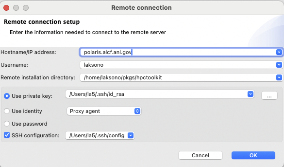
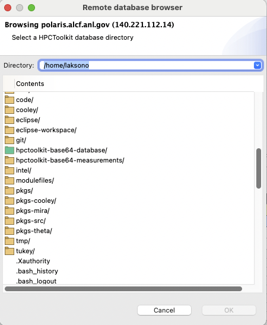

# Overview

HPCViewer now supports opening databases located on remote hosts. This capability allows users to access and analyze performance data from remote locations seamlessly. The communication between `hpcviewer` and the remote host is highly secure, ensuring that all data transfers are protected.

To achieve this level of security, the communication between `hpcviewer` and the remote host is encapsulated within an SSH tunnel. This setup guarantees that all data exchanged between the client and server is encrypted, safeguarding it from unauthorized access or tampering. Additionally, the server uses a UNIX socket domain to connect with the client, providing an added layer of security by restricting the communication scope to the local environment on the server side.

A key advantage of this implementation is that no remote files are written to the local disk during the process. This design choice ensures that sensitive performance data remains solely on the remote host, mitigating the risk of data leakage or unauthorized local access. Users can interact with the remote database in real-time, viewing and analyzing performance metrics without the need to download or store any data locally.

To enable the opening of remote databases, one needs to build and install a program called `hpcserver` on the remote host. This application acts as the intermediary between `hpcviewer` and the remote database, facilitating secure and efficient communication. Written entirely in Java, `hpcserver` ensures cross-platform compatibility and robustness. It requires Java 17 or newer to function correctly, leveraging the latest Java features and security enhancements.


# Building and installing hpcserver

**Requirements**:

- Java 17 or newer
- Maven 3.8.4 or newer

**Build and install**:

1. Checkout the `main` branch of `hpcserver`:

   ```
   git clone https://gitlab.com/hpctoolkit/hpcserver
   git checkout main
   ```

2. Build using Maven

   ```
   mvn clean package
   ```

3. Install to a directory with the `install.sh` script
   ```
   ./scripts/install.sh /path/hpctoolkit
   ```


# Opening a remote database with hpcviewer

Steps to opening a remote database:

1. Click the menu `File` - `Open remote database`

2. On **Remote connection** window, type the required fields:
   | Remote connection window |
   | :----------------------: |
   ||

   - `Hostname`: the name of the remote host where `hpcserver` is installed
   - `Username`: the username at the remote host
   - `Remote installation directory`: the absolute path of `hpcserver` installation. In the above case, it's `/path/hpctoolkit`

   To facilitate the connection, `hpcviewer` allows to connect via three options:
   - `Use private key`: this is the recommended way to avoid typing the password all the time. One needs to provide the location of the private key file.
   - `Use identity`: this is an experimental feature to connect via user's SSH identity.
   - `Use password`: use the option if private key is not available.

   If available, it is recommended to enable `SSH configuration` to simplify the connection to a remote host that requires multiple hops or *proxy jump*. Usually the configuration file is located at `$HOME/.ssh/config` on most POSIX platforms.

   Once the configuration is set, one needs to click the `OK` button to start the connection.
   
3. If the connection succeeds, one has to choose an HPCToolkit database from the **Remote database browser** window. 
   The window shows the current remote directory at the top, and the list of its content:
   | Remote database browser window |
   | :----------------------------: |
   ||
   
   - A yellow folder icon represents a regular directory, and one can access it via double-click at the icon or the name of the folder.
   - A green folder icon represents an HPCToolkit database. Selecting this item will enable the `OK` button.
   - A no icon item represents a regular file.
   
   Note: the `OK` button will remain disabled until one selects an HPCToolkit database.

