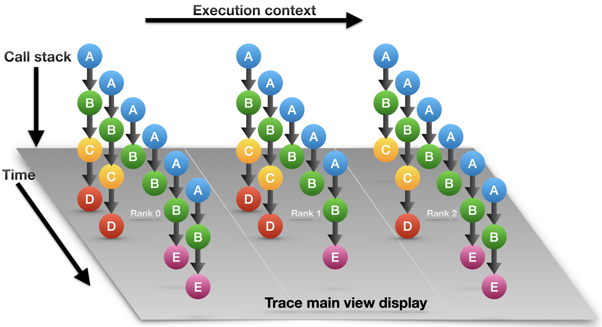
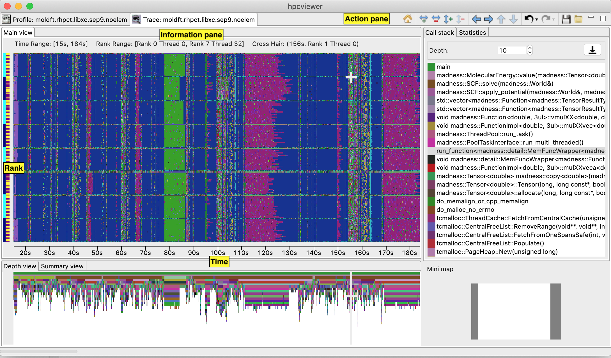
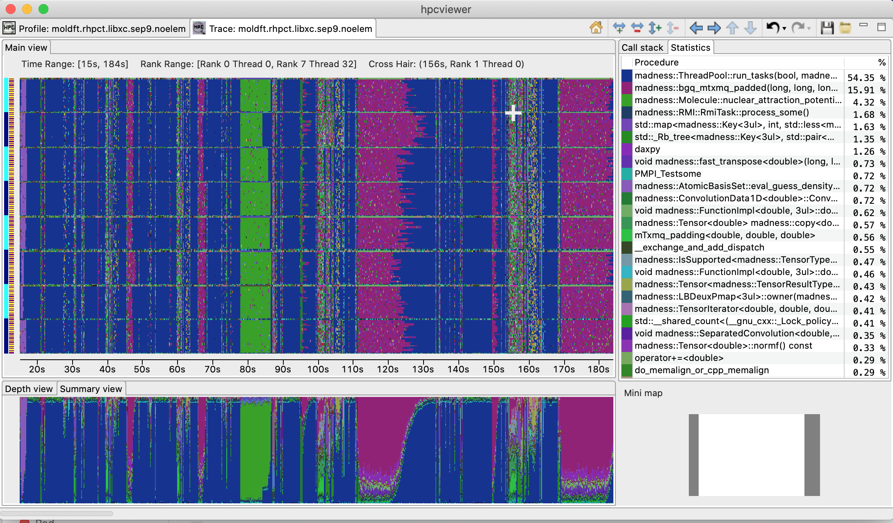
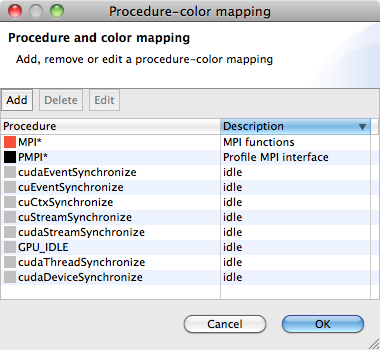
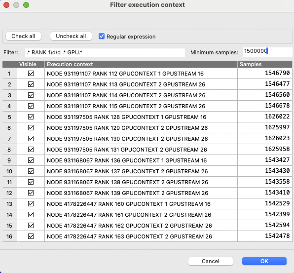

<a name="sec:trace" />

## Trace view

Trace view [N. R. Tallent et al. 2011](http://doi.acm.org/10.1145/1995896.1995908) is a time-centric user interface for interactive examination of a sample-based time series (hereafter referred to as a trace) view of a program execution.
Trace view can interactively present a large-scale execution trace without concern for the scale of parallelism it represents.

To collect a trace for a program execution, one must instruct HPCToolkit's measurement system to collect a trace.
When launching a dynamically-linked executable with `hpcrun`, add the `-t ` flag to enable tracing.
When launching a statically-linked executable, set the environment variable `HPCRUN_TRACE=1` to enable tracing.
When collecting a trace, one must also specify a metric to measure. The best way to collect a useful trace is to asynchronously sample the execution with a time-based metric such as `REALTIME`, `CYCLES`, or `CPUTIME`.

<a name="fig:hpctraceviewer-callpath" />

| Trace dimensions |
| :--------------: |
||
| Logical view of trace call path samples on three dimensions: **time**, **execution context** (rank/thread/GPU) and **call stack**.|

As shown in [Trace dimensions](#fig:hpctraceviewer-callpath) figure above, call path traces consist of data in three dimensions: *execution context* (also called *profile*) which represents a process or a thread rank or a GPU stream, *time*, and *call stack*.
A *crosshair* in Trace view is defined by a triplet `(p,t,d)` where `p` is the selected process/thread rank, `t` is the selected time, and `d` is the selected call stack depth.

Trace view renders a view of processes and threads over time. The [*Depth View*](#sec:depthview) shows the call stack depth over time for the thread selected by the cursor.
Trace view's [*Call-stack View*](#sec:callview) shows the call stack associated with the thread and time pair specified by the cursor.
Each of these views plays a role for understanding an application's performance.

In Trace view, each procedure is assigned specific color. [Trace dimensions](#fig:hpctraceviewer-callpath) figure above shows that at depth 1 each call stack has the same color: blue. This node represents the main program that serves as the root of the call chain in all process at all times. At depth 2, all processes have a green node, which indicates another procedure.
At depth 3, in the first time step all processes have a yellow node; in subsequent time steps they have purple nodes.
This might indicate that the processes first are observed in an initialization procedure (represented by yellow) and later observed in a solve procedure (represented by purple). The pattern of colors that appears in a particular depth slice of the Main View enables a user to visually identify inefficiencies such as load imbalance and serialization.

<a name="fig:hpctraceviewer-legend" />

| Trace view with legends |
| :---------------------: |
||
| A snapshot traces of an MPI+OpenMP program. The main view shows the *Rank* or *Execution context* as the Y-axis and the program execution *time* as the X-axis.|

The above [Trace View](#fig:hpctraceviewer-legend) figure highlights Trace view's four principal window panes: [Main View](#sec:mainview), [Depth View](#sec:depthview), [Call Stack View](#sec:callview) and [Mini Map View](#sec:miniview),
while [Trace View](#fig:hpctraceviewer-stat) figure below shows additional two window panes: [Summary View](#sec:summaryview) and Statistics View:

<a name="fig:hpctraceviewer-stat" />

| Trace view with the Summary View and Statistics View |
| :--------------------------------------------------: |
|
| A screenshot of `hpcviewer`'s Trace view showing the Summary View (tab in bottom, left pane) and Statistics View (tab in top, right pane) |

- **Main View** (top, left pane):
  This is Trace view's primary view.
  This view, which is similar to a conventional process/time (or space/time) view, shows time on the horizontal axis and process (or thread) rank on the vertical axis; time moves from left to right.
  Compared to typical process/time views, there is one key difference.
  To show call stack hierarchy, the view is actually a user-controllable slice of the process/time/call-stack space.
  Given a call stack depth, the view shows the color of the currently active procedure at a given time and process rank.
  (If the requested depth is deeper than a particular call stack, then Trace view simply displays the deepest procedure frame and, space permitting, overlays an annotation indicating the fact that this frame represents a shallower depth.)
   
  Trace view assigns colors to procedures based on (static) source code procedures.
  Although the color assignment is currently random, it is consistent across the different views.
  Thus, the same color within the Trace and Depth Views refers to the same procedure.
   
  The Trace View has a white crosshair that represents a selected point in time and process space.
  For this selected point, the [Call Stack View](#sec:callview) shows the corresponding call stack.
  The Depth View shows the selected process.

<a name="sec:depthview" />

- **Depth View** (tab in bottom, left pane):
  This is a call-path/time view for the process rank selected by the Main View's crosshair.
  Given a process rank, the view shows for each virtual time along the horizontal axis a stylized call stack along the vertical axis, where 'main' is at the top and leaves (samples) are at the bottom.
  In other words, this view shows for the whole time range, in qualitative fashion, what the Call Path View shows for a selected point.
  The horizontal time axis is exactly aligned with the Trace View's time axis; and the colors are consistent across both views.
  This view has its own crosshair that corresponds to the currently selected time and call stack depth.
  One can specify a new crosshair time and a new time range:
    - Selecting a new crosshair time `t` can be performed by clicking a pixel within Depth View. This will update the crosshair in Main View and the call path in Call Stack View.
    - Selecting a new time range \[`t_m`,`t_n`\] = {`t` | `t_m` \<= `t` \<= `t_n`} is performed by first clicking the position of `t_m` and drag the cursor to the position of `t_n`. A new content in Depth View and Main View is then updated. Note that this action will not update the call path in Call Stack View since it does not change the position of the crosshair.

<a name="sec:summaryview" />

- **Summary View** (tab in bottom, left pane):
  The view shows for the whole time range displayed, the proportion of each subroutine in a certain time.
  Similar to Depth view, the time range in Summary reflects to the time range in the Trace view.

<a name="sec:callview" />

- **Call Stack View** (tab in top, right pane):
  This view shows two things: 
    - the current call stack depth that defines the hierarchical slice shown in the Trace View; and 
    - the actual call stack for the point selected by the Trace View's crosshair.
  To easily coordinate the call stack depth value with the call path, the Call Stack View currently suppresses details such as loop structure and call sites; we may use indentation or other techniques to display this in the future.
  In this view, the user can select the depth dimension of Main View by either typing the depth in the depth editor or selecting a procedure in the table of call stack.

- **Statistics View** (tab in top, right pane):
  This view shows the list of procedures active in the space-time region shown in the Trace View at the current Call Path Depth. Each procedure's percentage in the Statistics View indicates the percentage of pixels in the Trace View pane that are filled with this procedure's color at the current Call Path Depth. When the Trace View is navigated to show a new time-space interval or the Call Path Depth is changed, the statistics view will update its list of procedures and the percentage of execution time to reflect the new space-time interval or depth selection.

- **GPU Idleness Blame View** (tab in top, right pane, not shown):
  The view is only available if the database contains information on GPU traces. It shows the list of procedures that cause GPU idleness displayed in the trace view.
  If the trace view displays one CPU thread and multiple GPU streams, then the CPU thread will be blamed for the idleness for those GPU streams.
  If the view contains more than one CPU threads and multiple GPU streams, then the cost of idleness is share among the CPU threads.

<a name="sec:miniview" />

- **Mini Map View** (right, bottom):
  The Mini Map shows, relative to the process/time dimensions, the portion of the execution shown by the Trace View.
  The Mini Map enables one to zoom and to move from one close-up to another quickly.
  The user can also moving the current selected region to another region by clicking the white rectangle and drag it to the new place.

<a name="sec:mainview" />

### Action and Information Pane

Main View is divided into two parts: the top part which contains *action pane* and the *information pane*, and the main canvas which displays the traces.

The buttons in the action pane are the following:

- **Home**  : Resetting the view configuration into the original view, i.e., viewing traces for all times and processes.

- **Horizontal zoom in  / out**  : Zooming in/out the time dimension of the traces.

- **Vertical zoom in  / out ** : Zooming in/out the process dimension of the traces.

- **Navigation buttons** , , ,  : Navigating the trace view to the left, right, up and bottom, respectively. It is also possible to navigate with the arrow keys in the keyboard. Since Main View does not support scroll bars, the only way to navigate is through navigation buttons (or arrow keys).

- **Undo**  : Canceling the action of zoom or navigation and returning back to the previous view configuration.

- **Redo**  : Redoing of previously undo change of view configuration.

- **Save**  / **Open  a view configuration** : Saving/loading a saved view configuration.
  A view configuration file contains the information about the process/thread and time ranges shown, the selected depth, and the position of the crosshair.
  It is recommended to store the view configuration file in the same directory as the database to ensure that the view configuration file matches the database since a configuration does not store its associated database.
  Although it is possible to open a view configuration file associated with a different database, it is not recommended since each database has different time/process dimensions and depth.

At the top of an execution's Main View pane is some information about the data shown in the pane.

- **Time Range**. The time interval shown along the horizontal dimension.
- **Cross Hair**. The crosshair indicates the current cursor position in the time and execution-context dimensions.

<a name="sec:color-map" />

### Customizing the Color of Procedures

Trace view allows users to customize assignment of a pattern of procedure names with a specific color.  
To do that, one can select the `View - Color map` menu, and `Color Map` window will appear as shown below:

| Color map window |
| :----------------------------: |
|  |
| An example of procedure-color map window, where all MPI procedures will be associated with color red |

To add a new procedure-color map, one needs to click the `Add` button and a new window will appear.
In this window, one can specify the procedure's name or a *glob* pattern of procedure, and then specify the color to be associated by clicking the color button.
Clicking `OK` will close the window and add the new color map to the global list. 
Note that this map is persistent across hpcviewer sessions, and will apply to other databases as well.

### Filtering Execution Contexts

One can select which execution contexts (ranks or threads or GPU streams) to be displayed in Trace View, by selecting the `Filter - execution contexts` menu.
This will display a filter window which allows to select which execution contexts to be shown:

| Filter execution context window |
| :----------------------------: |
|  |
| An example of narrowing the list of execution contexts using both a regular expression and the minimum number of samples criteria |

Similar to [Profile View's thread selection](profile.html#sec:thread-level-table), one can narrow the list by specifying the name of the execution context on the filter part of the window. 
In addition, one can also narrow the list based on the minimum number of trace samples (the third column of the table) as shown by the above figure.

### Tips
- Sometimes it is helpful to associate a group of procedures (such as `MPI_*`) to a certain color to approximate its statistic percentage.
- Trace view also provides a context menu by right-clicking at the view to save the current display. 
  This context menu is available is three views: trace view, depth view and summary view.

